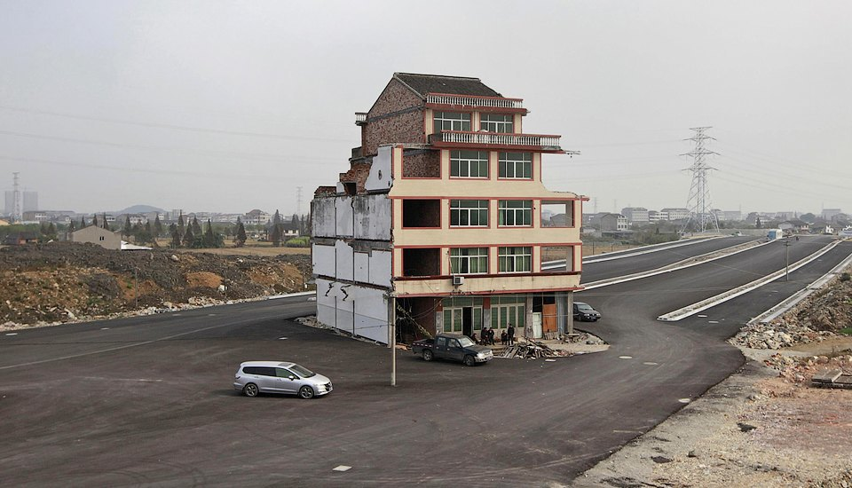
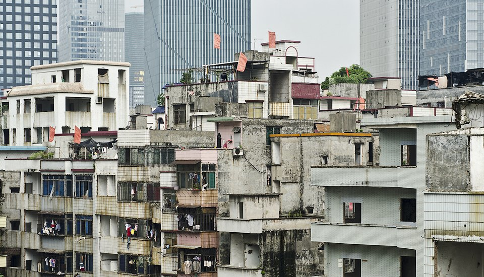
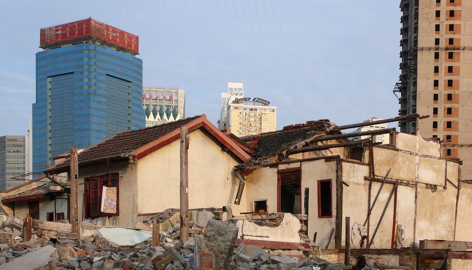
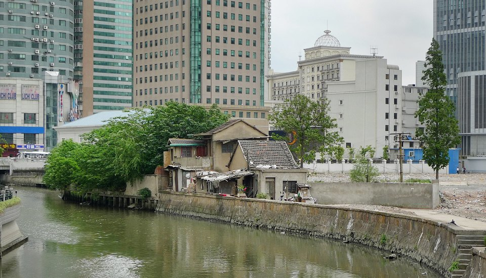
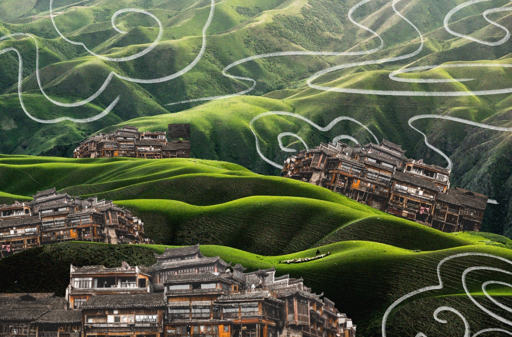

# How do the residents of old houses resist the construction boom?

## Where China's most stubborn people live

Throughout China, you can find lonely old houses, which as if nothing had happened in the middle of an unfinished road or block with multi-storey buildings. Their owners refuse to leave the property and exchange it for an apartment in the bedroom area. This is how they resist the construction boom, which in recent years has spread to the rapidly developing south of China. We have collected photos of these centers of struggle against westernization and state capitalism.

# The phenomenon of "ghost towns" in China: wastefulness or foresight?

We find out why there are still empty settlements in the most populated country in the world and what actions the government and business can "revive" them.

The city of Tianducheng is a "little Paris" in China. It has everything that attracts millions of people to the French capital - the Eiffel Tower, more than a hundred meters high, a recognizable urban landscape, parks, squares and sculptures. However, the photos that you can find on the Internet, are reminiscent of the first episodes of the famous anime Hayao Miyazaki "Gone with Ghosts". There, little Tihiro and his parents find themselves in a strange town where there is not a soul.

Tianducheng is one of several Chinese copitaux imitating the famous settlements of Europe. And it can also be found on request "Chinese ghost towns" - these are places that are completely ready for life, but almost empty. Such cities were built at a rapid pace during the "Chinese construction boom" of the first decade of the XXI century. But why build houses and infrastructure, which no one uses? What is this - an expensive scam or the notorious Chinese foresight?

## A city the size of a country

The media often refer to "ghost cities" (ghost towns) as insufficiently populated areas of mass development in China. However, this is technically wrong. This term refers to a previously thriving and economically active place, which over time has become abandoned.

In turn, these settlements in China - are new objects designed for a large number of residents who never appeared. In addition, some of these ghost towns (for convenience, we will still have to use this definition) are not independent administrative units, but only areas located in the suburbs of existing settlements.

As Forbes magazine notes, there is a fundamental difference between China and the West defining and using the concept of "city". In China, it is rather an administrative term, which is used to refer to a vast territory under the administration of the city. De facto, however, a large part of the land under the authority of the municipality is urban only by name and may include large agricultural areas, mountains, forests or deserts. Thus, in China there are "cities" the size of four Odessa regions. For example, Hulun Buir in Inner Mongolia is the largest urban district in the world with an area approximately from New Zealand, but it consists of 99% of pasture. So the term "city" means that its areas can actually be under the control of many individual administrations.

